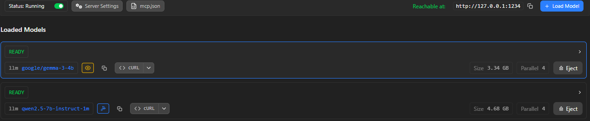
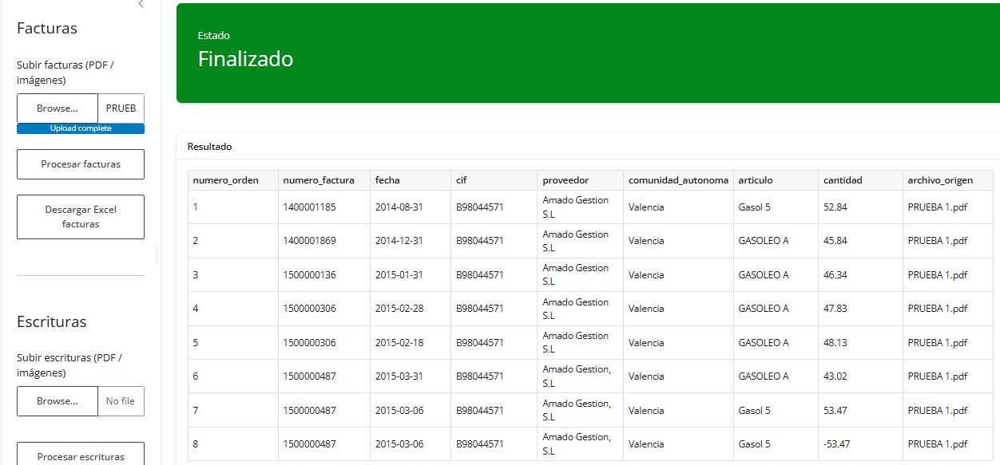

# Sistema de Extracción y Clasificación Documental Jurídica. Caso Varona

## 1. Descripción del Proyecto
Aplicación orientada a despachos jurídicos para la extracción automatizada, estructuración y clasificación de facturas y documentación patrimonial en procedimientos masivos y complejos (herencias, concursos, disoluciones societarias, liquidaciones, litigios en masa, etc.).

El sistema permite:

- Carga de documentación heterogénea (PDF escaneados, facturas digitales).
- Aplicación de OCR para digitalización de documentos.
- Extracción estructurada de datos mediante LLM.
- Generación automatizada de Excel listo para uso procesal.
- Preparación para futura integración con fuentes públicas (Catastro, registros).

Este proyecto nace para resolver la problemática descrita en el reto empresarial del despacho.

## 2. Problema que Resuelve

Actualmente, el despacho realiza la toma de datos de forma manual, volcando información en Excel, lo que implica:

- Alto consumo de tiempo.
- Riesgo de errores humanos.
- Dificultad para procesar grandes volúmenes documentales.
- Baja trazabilidad.

El sistema automatiza este proceso, alineado con los criterios de evaluación definidos en el contexto empresarial.

## 3. Objetivos
🎯 Objetivo Principal

- Extracción automatizada de datos de facturas.
- Clasificación estructurada para uso probatorio.
- Generación de Excel consolidado.

➕ Objetivo Adicional

- Extracción de información de escrituras.
- Identificación de bienes inmuebles.
- Conexión futura con Catastro para obtención automática de valor de referencia

## 4. Arquitectura del Sistema
🔹 Facturas
```markdown
PDF / Imagen
    ↓
ocr.py
    ↓
llm_extractor.py
    ↓
envoice_processor.py
    ↓
envoice_excel_exporter.py
```
🔹 Escrituras
```markdown
PDF / Imagen
    ↓
ocr.py
    ↓
llm_extractor.py
    ↓
deed_processor.py
    ↓
deed_validator.py
    ↓
catastro_enricher.py
    ↓
deed_excel_exporter.py
```
## 5. Estructura del Proyecto
```markdown
LLMTHONLEGAL2026/
│
├── data/                        # Carpeta para test
│
├── app.py                       # Punto de entrada principal
│
├── ocr.py                       # Extracción de texto (OCR)
│
├── llm_extractor.py             # Lógica de extracción mediante LLM
│
├── envoice_processor.py         # Procesamiento de facturas
├── envoice_excel_exporter.py    # Exportación Excel de facturas
│
├── deed_processor.py            # Procesamiento de escrituras
├── deed_validator.py            # Validación de datos patrimoniales
├── deed_excel_exporter.py       # Exportación Excel de bienes
│
├── test_ocr.py                  # Test módulo OCR
├── test_deed.py                 # Test módulo escrituras
│
├── requirements.txt
└── README.md
```
## 6. Instalación
### Requisitos
- Python 3.10+
- openpyxl
- Tesseract OCR instalado en el sistema
- Cliente LLM (OpenAI / compatible)
- Shiny for Python
- Entorno virtual recomendado

### Instalación
```sh
git clone <repo>
cd LLMTHONLEGAL2026
python -m venv venv
source venv/bin/activate  # Windows: venv\Scripts\activate
pip install -r requirements.txt
```

## Configuración del LLM (LM Studio)

El sistema utiliza LM Studio como servidor local de inferencia.

### Descargar LM Studio
`https://lmstudio.ai/`

### Modelo recomendado
Para facturas y documentación jurídica se recomienda:

- qwen2.5-7b-instruct (equilibrio rendimiento/calidad)
- gemma-3-4b (alternativa ligera)

El modelo puede cambiarse desde `llm_extractor.py` según necesidades de rendimiento o precisión.

### Iniciar servidor
Activar:
"Start Server"

Puerto por defecto:
`http://localhost:1234/v1`

<p align="center">
    
</p>

### Conectar con la aplicación
Se conectará desde `llm_extractor.py` de la siguiente manera:
```python
modelo = "google/gemma-3-4b"
response = client.chat.completions.create(
        model = modelo,
        messages=[{"role": "user", "content": prompt}],
        temperature=0
    )
```

## 7. Aplicación web
El sistema se ejecuta como aplicación web local utilizando `Shiny` for Python.
Ejecutar aplicación principal:
```sh
shiny run app --reload
```
Por defecto la aplicación se levanta en entorno local y es accesible desde:
```sh
http://localhost:8000/
```
<p align="center">
    
</p>

## 8. Flujo de Uso
1. Carga del documento (factura o escritura).
2. Aplicación automática de OCR.
3. Extracción estructurada mediante LLM.
4. Procesamiento y validación.
5. Generación y descarga del archivo Excel.

## 9. Calidad y Validación
El sistema está diseñado para:

- Procesar grandes volúmenes documentales.
- Reducir errores respecto al proceso manual.
- Permitir trazabilidad.
- Detectar datos incompletos.
- Facilitar futura integración con registros públicos.

## 10. Limitaciones Actuales
- La precisión depende de la calidad del escaneo.
- No existe integración directa con Catastro.
- Puede requerir validación humana en casos complejos.

## 11. Mejoras Futuras
- Integración API Catastro.
- Detección automática de duplicidades.
- Auditoría y logs estructurados.
